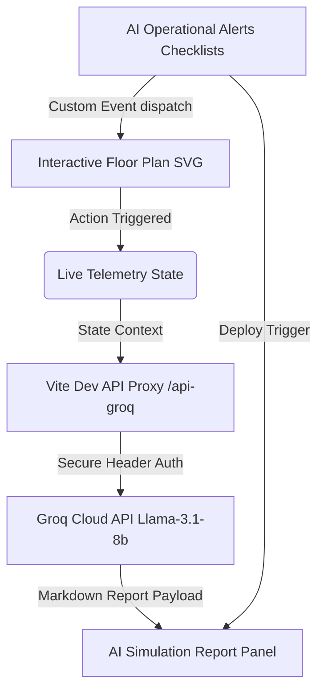

# 🏥 PulseSync AI — Live Clinical Intelligence & Floor Command

PulseSync AI is a premium, real-time hospital floor command dashboard that bridges the gap between clinical operations, predictive surge modeling, and live tactical emergency responses. Using advanced SVG layouts, real-time event logging, and integrated Groq Llama-3.1 models, PulseSync AI helps administrators optimize workflows, predict bottlenecks, and coordinate emergency responses.

---

## 🚨 The Problem Statement
Modern hospitals face immense operational challenges:
* **Critical Overloads**: Surge influxes in Emergency Departments and ICU wards go undetected until capacity is blocked.
* **Clinician Burnout**: Shift patterns and case surges lead to stress zones without operational coverage adjustments.
* **Delayed Response Protocols**: Emergency diversion, lockdowns, and evacuations are often slow to initiate, relying on manual calculations.
* **Static Analytics**: Traditional dashboards show past bottlenecks rather than simulating live responses in a spatial, interactive interface.

---

## 💡 The Solution We Developed
PulseSync AI introduces a premium, spatial command center:
1. **Interactive Live Hospital Floor Map**:
   * A vectorized layout rendering floor divisions (ICU sectors, operation theaters, scrub bays, and pharmacy wards).
   * Live flow animations (patient inflow particle streams, active evacuation paths, and rotating security locks).
   * 12 distinct **Tactical Response Actions** covering Emergency, Clinical, and Resource safety triggers.
2. **AI Simulation & Tactical Reports**:
   * Fully powered by **Groq Llama-3.1**. Clicking any floor action calls the LLM proxy to generate live simulation reports containing status reports, impact analysis, and recommended next steps.
   * Keeps a running, tabbed history of the last 10 reports.
3. **AI Operational Alerts & Task Checklists**:
   * Dynamic alerts panel highlighting immediate or predicted department risks.
   * Interactive task checklists where ticking items logs events live in the floor map's feed.
   * Auto-resolving deployment flows that cycle in fresh, real-time alerts from a reserve pool.
4. **AI Crisis Simulator**:
   * Stress-test models calculating staffing deficits, bed shortages, and risk levels.
   * Custom UI rendering interactive, categorized mitigation protocols (IMMEDIATE, 15 MIN, 1 HOUR urgency levels).
5. **Surge & Bottlenecks Delay Forecast**:
   * De-congested vertical layout containing predictive inflow charts, department distributions, and color-coded overload risk tables.

---

## ⚙️ How It Works & Architecture



### Tech Stack
* **Frontend Core**: React 18, TypeScript, Vite
* **Styling & Animations**: Vanilla CSS, Tailwind, Framer Motion
* **Visuals & Charts**: Vector SVG, custom CSS paths, Lucide Icons
* **AI Engine**: Groq Cloud API (`llama-3.1-8b-instant`)

---

## 🚀 Setup & Execution

### 1. Environment Variables Configuration
To keep API credentials secure, copy the example environment file:
```bash
cp .env.example .env
```
Open `.env` and enter your Groq API key:
```env
VITE_GROQ_API_KEY=gsk_your_actual_key_here
```

### 2. Install Dependencies
```bash
npm install
```

### 3. Run Local Development Server
```bash
npm run dev
```
Open **[http://localhost:5173](http://localhost:5173)** in your browser.

### 4. Build for Production
```bash
npm run build
```
The optimized bundle will be generated under the `dist/` directory.
